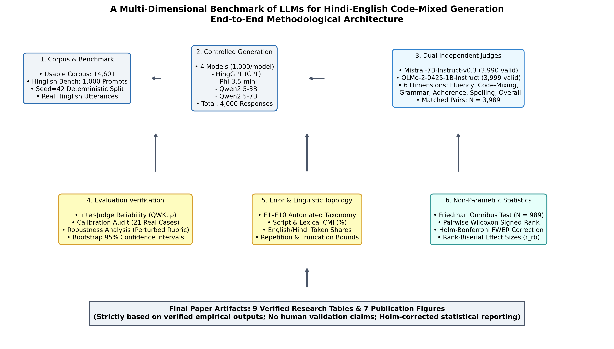
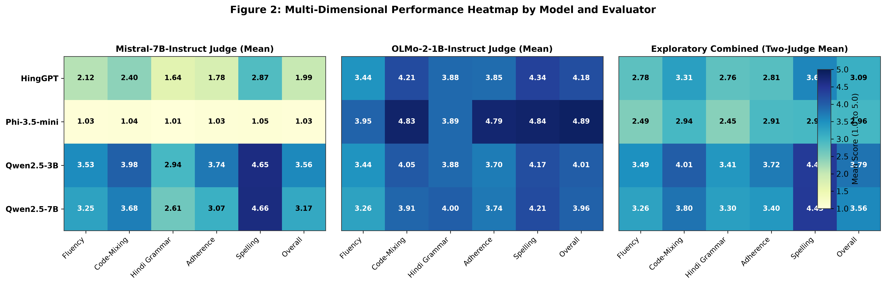
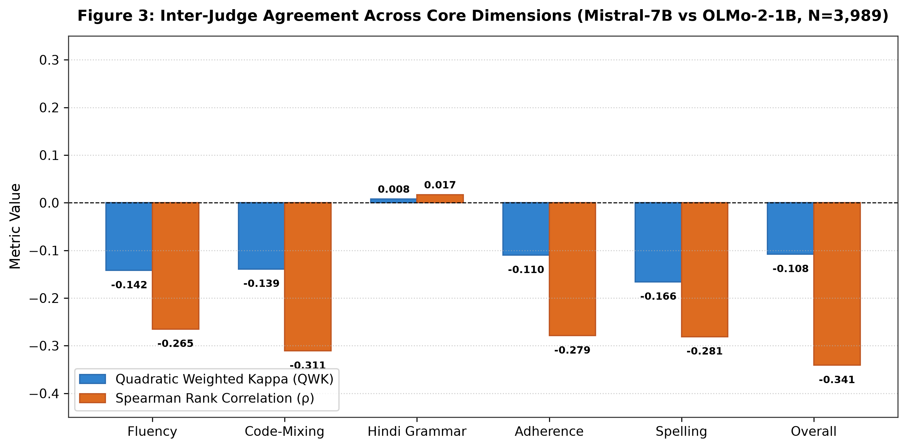
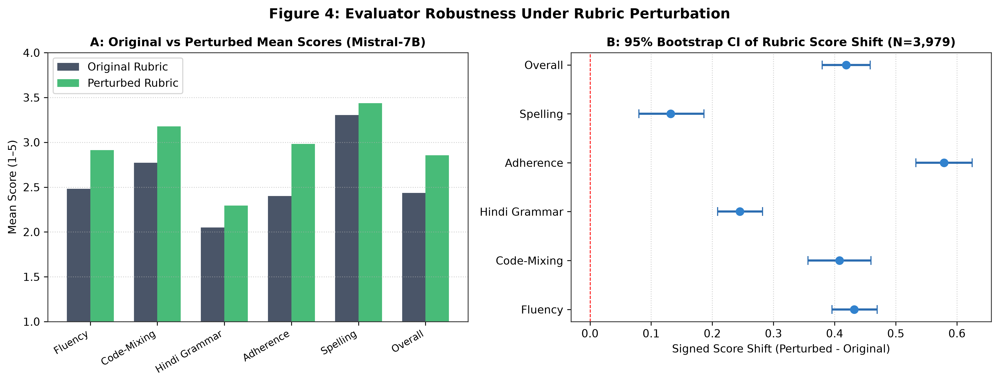
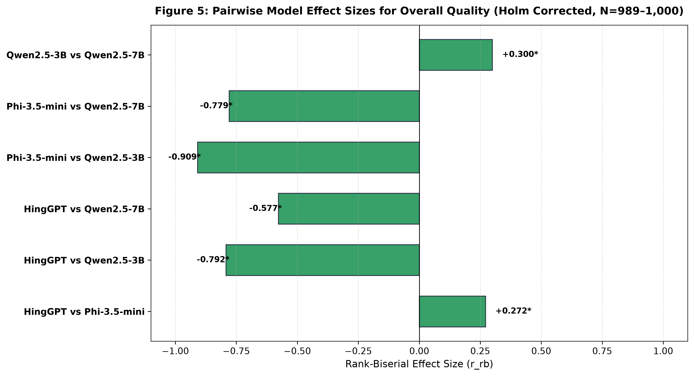
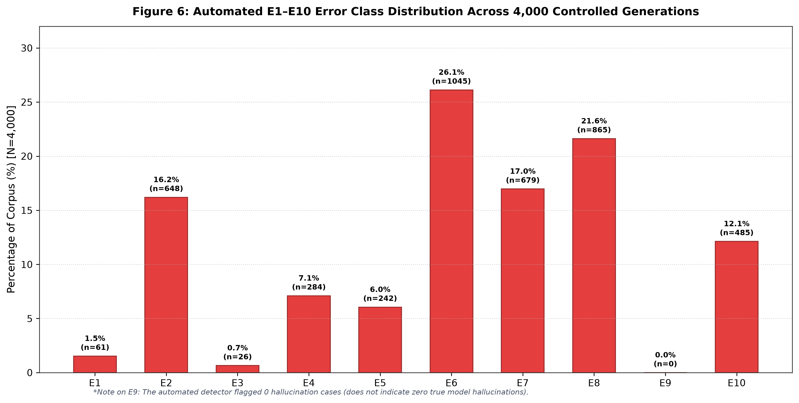
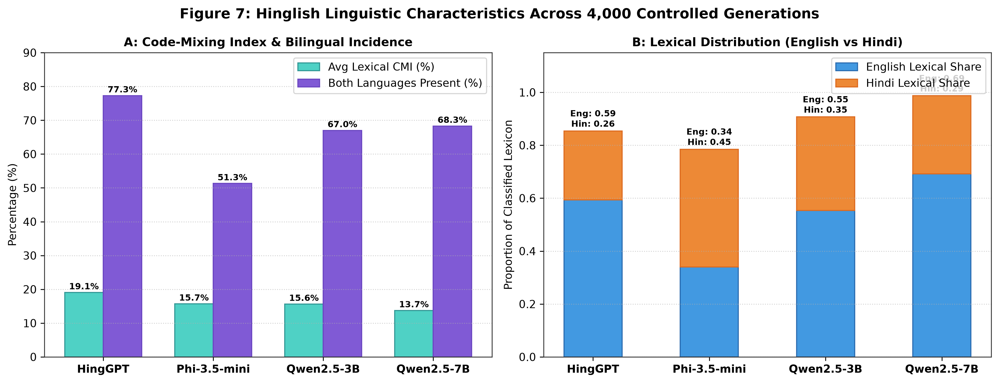

# A Multi-Dimensional Benchmark of LLMs for Hindi-English Code-Mixed Generation

[](https://opensource.org/licenses/MIT)
[](https://www.python.org/)
[]()

A reproducible multi-dimensional benchmark for evaluating Large Language Models (LLMs) on **Hindi-English code-mixed (Hinglish) generation** across linguistic quality, prompt adherence, robustness, statistical significance, error patterns, and Hinglish-specific linguistic characteristics.

---

## 1. Research Objective & Motivation

Hindi-English code-mixed language is widely used in informal communication, social media, digital services, education, and everyday online interactions. However, conventional text-generation evaluation metrics do not fully capture the characteristics of code-mixed language.

This project develops a controlled evaluation framework for studying how different LLMs generate Hinglish and how their outputs differ across multiple quality dimensions.

The benchmark evaluates:

* **Fluency**
* **Code-mixing quality**
* **Hindi grammatical quality**
* **Prompt adherence**
* **Spelling / transliteration quality**
* **Overall response quality**
* **Evaluator robustness**
* **Error patterns**
* **Hinglish-specific linguistic characteristics**

The objective is not to reduce Hinglish generation quality to a single metric, but to provide a **multi-dimensional and statistically supported comparison framework**.

---

## 2. Models Evaluated

Four models were evaluated under the same controlled benchmark:

| Model            | Model Type           | Role                               |
| ---------------- | -------------------- | ---------------------------------- |
| **HingGPT**      | Hinglish-specialized | Domain-focused Hinglish generation |
| **Phi-3.5-mini** | General-purpose      | Compact instruction-tuned LLM      |
| **Qwen2.5-3B**   | General-purpose      | Multilingual LLM                   |
| **Qwen2.5-7B**   | General-purpose      | Higher-capacity multilingual LLM   |

The evaluation uses the same benchmark prompts and controlled generation procedure across all four models.

---

## 3. Dataset & Benchmark

The project uses a cleaned and deduplicated **Natural Hinglish Corpus** containing approximately **14,601 usable rows**.

The benchmark used for final controlled evaluation contains exactly:

* **1,000 benchmark prompts**
* **4 models**
* **4,000 controlled generations**
* The same 1,000 prompts are evaluated across all models

Benchmark file:

```text
data/benchmarks/hinglish_bench_.csv
```

### Benchmark Structure

| Field         | Description                           |
| ------------- | ------------------------------------- |
| `prompt_id`   | Unique benchmark prompt identifier    |
| `row_index`   | Source row reference                  |
| `prompt`      | Controlled Hinglish generation prompt |
| `source_text` | Corresponding source text             |

The benchmark is designed so that model outputs can be compared under the same prompt conditions.

---

## 4. Research Pipeline

The complete evaluation pipeline is:

```text
Natural Hinglish Corpus
        │
        ▼
Data Cleaning & Deduplication
        │
        ▼
Train / Validation Preparation
        │
        ▼
QLoRA Continued Pretraining (CPT)
        │
        ▼
CPT-Adapted Models
        │
        ▼
Hinglish-Bench
1,000 Controlled Prompts
        │
        ▼
4 Models × 1,000 Prompts
        │
        ▼
4,000 Controlled Generations
        │
        ├──────────────────────────────┐
        │                              │
        ▼                              ▼
Mistral-7B-Instruct-v0.3        OLMo-2-1B-Instruct
Independent Judge 1             Independent Judge 2
        │                              │
        └──────────────┬───────────────┘
                       ▼
             Inter-Judge Reliability
              QWK + Spearman ρ
                       │
                       ▼
             Robustness Evaluation
             Perturbed Mistral Rubric
                       │
                       ▼
          Statistical Analysis
     Friedman + Wilcoxon + Holm
     Effect Sizes + Bootstrap CI
                       │
                       ▼
               Error Analysis
                 E1 – E10
                       │
                       ▼
        Hinglish Linguistic Metrics
                       │
                       ▼
        Final Tables + Figures
                       │
                       ▼
             Research Paper
                       │
                       ▼
             Hinglish Chatbot
```

---

## 5. Controlled Generation

The final benchmark produces **4,000 controlled generations**:

```text
1,000 prompts × 4 models = 4,000 generations
```

The main controlled-generation outputs are stored under:

```text
outputs/controlled_1000/
```

Primary files include:

```text
benchmark_generations_.csv
benchmark_generations_.jsonl
generation_config_.json
```

The benchmark uses the same prompts across all models to maintain controlled comparison conditions.

---

## 6. Independent LLM Evaluation

Two independent instruction-tuned LLM judges were used.

### Judge 1

**Mistral-7B-Instruct-v0.3**

### Judge 2

**OLMo-2-1B-Instruct**

The judges evaluate the generated responses across six core dimensions:

1. Fluency
2. Code-Mixing
3. Hindi Grammar
4. Prompt Adherence
5. Spelling
6. Overall Quality

Scores use a **1–5 scale**.

Final judge outputs are stored under:

```text
outputs/independent_judge_1000/
```

The corrected OLMo evaluation is used for the final analysis rather than the earlier corrupted evaluation output.

---

## 7. Inter-Judge Reliability

Agreement between the two independent judges is evaluated using:

* **Quadratic Weighted Kappa (QWK)**
* **Spearman Rank Correlation (ρ)**

The purpose is to measure whether the two independent evaluators provide consistent assessments of the same generated responses.

The final analysis indicates that judge agreement varies substantially across dimensions. This is treated as an important methodological finding rather than being hidden or artificially corrected.

Final reliability outputs are available under:

```text
outputs/reliability_1000_FINAL/
```

---

# 8. Evaluator Robustness

A robustness experiment evaluates whether changing the evaluation rubric affects the Mistral judge's scores.

The same 4,000 generated responses are evaluated under a **perturbed Mistral rubric**.

The analysis includes:

* Original vs perturbed mean scores
* Spearman correlation
* Weighted agreement
* Mean absolute score change
* Signed score change
* Model-level score changes
* Rank/order stability
* Bootstrap 95% confidence intervals

The robustness outputs are stored under:

```text
outputs/final_robustness/
```

---

# 9. Statistical Analysis

The statistical analysis evaluates whether observed differences between models are supported by matched statistical tests.

The analysis includes:

### Friedman Test

Used for multi-model repeated comparisons across benchmark observations.

### Wilcoxon Signed-Rank Test

Used for pairwise matched comparisons between models.

### Holm Correction

Applied to multiple pairwise comparisons to control the family-wise error rate.

### Rank-Biserial Effect Size

Effect sizes are reported alongside statistical significance.

### Bootstrap Confidence Intervals

Bootstrap procedures are used to estimate 95% confidence intervals for relevant comparisons.

Statistical outputs are available under:

```text
outputs/statistical_analysis_1000_FINAL/
```

Important statistical files include:

```text
final_friedman_results.csv
final_wilcoxon_pairwise_holm.csv
final_bootstrap_95ci_pairwise.csv
final_model_means_two_judge.csv
```

The exploratory two-judge composite is interpreted together with the inter-judge reliability results rather than being treated as an unquestionable ground truth.

---

# 10. Error Analysis: E1–E10

A structured error taxonomy is used to identify common failure patterns across the 4,000 controlled generations.

| Code    | Error Type                       |
| ------- | -------------------------------- |
| **E1**  | English-dominant output          |
| **E2**  | Hindi-dominant output            |
| **E3**  | Unnatural code-switching         |
| **E4**  | Grammatical error                |
| **E5**  | Repetition                       |
| **E6**  | Prompt misunderstanding          |
| **E7**  | Incomplete response              |
| **E8**  | Spelling / transliteration error |
| **E9**  | Hallucination / factual error    |
| **E10** | Irrelevant response              |

The automated analysis identified:

| Error | Count | Percentage |
| ----- | ----: | ---------: |
| E1    |    61 |       1.5% |
| E2    |   648 |      16.2% |
| E3    |    26 |       0.7% |
| E4    |   284 |       7.1% |
| E5    |   242 |       6.0% |
| E6    | 1,045 |      26.1% |
| E7    |   679 |      17.0% |
| E8    |   865 |      21.6% |
| E9    |     0 |       0.0% |
| E10   |   485 |      12.1% |

**Important:** E9 = 0 means that the automated detector flagged zero cases. It does **not** establish that the models produced no true hallucinations.

Error-analysis outputs are stored under:

```text
outputs/error_analysis/
```

---

# 11. Hinglish-Specific Linguistic Analysis

The project includes additional linguistic analysis designed specifically for Hinglish generation.

The analysis covers:

* English lexical share
* Hindi lexical share
* Code-Mixing Index (CMI)
* Presence of both languages
* Model-level lexical characteristics
* Response-level Hinglish characteristics

The CMI is treated as a **transparent heuristic indicator** of lexical mixing rather than a perfect language-identification system.

Final metric outputs:

```text
outputs/hinglish_metrics/
```

Important files:

```text
code_mixing_index.csv
code_mixing_summary.csv
model_level_hinglish_metrics.csv
response_level_hinglish_metrics.csv
```

---

# 12. Final Research Figures

All publication-oriented figures are stored under:

```text
outputs/final_charts/
```

## Figure 1 — Overall Methodology Pipeline



## Figure 2 — Multi-Dimensional Performance Heatmap



This figure presents model performance across the six evaluation dimensions for both independent judges and the exploratory two-judge composite.

## Figure 3 — Inter-Judge Agreement



This figure reports QWK and Spearman agreement between the Mistral-7B and OLMo-2-1B judges across the evaluated dimensions.

## Figure 4 — Evaluator Robustness



This figure shows original versus perturbed Mistral rubric scores and bootstrap confidence intervals for score shifts.

## Figure 5 — Pairwise Model Effect Sizes



This figure presents rank-biserial effect sizes for pairwise overall-quality comparisons after Holm correction.

## Figure 6 — E1–E10 Error Distribution



This figure summarizes the automated E1–E10 error distribution across the 4,000 controlled generations.

## Figure 7 — Hinglish Linguistic Characteristics



This figure presents model-level code-mixing characteristics and English/Hindi lexical distributions across the 4,000 controlled generations.

---

# 13. Final Research Tables

The final research tables are stored under:

```text
outputs/final_research_tables/
```

### Table 1 — Dataset & Benchmark Summary

```text
table_1_dataset_benchmark_summary.csv
```

### Table 2 — Generation Coverage

```text
table_2_generation_coverage.csv
```

### Table 3 — Overall Model Performance

```text
table_3_overall_model_performance.csv
```

### Table 4 — Dimension-Wise Performance

```text
table_4_dimension_wise_performance.csv
```

### Table 5 — Inter-Judge Reliability

```text
table_5_inter_judge_reliability.csv
```

### Table 6 — Robustness Analysis

```text
table_6_robustness_analysis.csv
```

### Table 7 — Statistical Significance & Pairwise Comparisons

```text
table_7_statistical_significance_pairwise.csv
```

### Table 8 — E1–E10 Error Analysis

```text
table_8_error_analysis_e1_e10.csv
```

### Table 9 — Hinglish Linguistic Metrics

```text
table_9_hinglish_linguistic_metrics.csv
```

These tables provide structured machine-readable versions of the main research results.

---

# 14. Repository Structure

```text
HinglishLLM/
│
├── README.md
├── paper.md
├── .gitignore
│
├── chatbot/
│   ├── app.py
│   └── chatbot.py
│
├── configs/
│
├── data/
│   ├── benchmarks/
│   │   └── hinglish_bench_.csv
│   └── model/
│
├── models/
│
├── outputs/
│   ├── controlled_1000/
│   ├── independent_judge_1000/
│   ├── reliability_1000_FINAL/
│   ├── statistical_analysis_1000_FINAL/
│   ├── error_analysis/
│   ├── hinglish_metrics/
│   ├── final_charts/
│   ├── final_research_tables/
│   └── final_robustness/
│
└── src/
    ├── evaluation/
    ├── metrics/
    ├── run_final_inter_judge_reliability.py
    ├── run_final_statistical_analysis.py
    └── run_olmo2_phi_repair.py
```

Large pretrained model weights and checkpoint files are excluded from normal Git tracking through `.gitignore` rules.

---

# 15. Reproducibility

The repository preserves the generated evaluation artifacts so that the final analysis can be inspected without regenerating all model outputs.

The main reproducibility components are:

```text
Benchmark
    ↓
Controlled generations
    ↓
Independent judges
    ↓
Reliability analysis
    ↓
Robustness analysis
    ↓
Statistical analysis
    ↓
Error analysis
    ↓
Hinglish metrics
    ↓
Final tables & figures
```

The benchmark generation configuration is stored in:

```text
outputs/controlled_1000/generation_config_.json
```

---

# 16. Environment

The project was developed and evaluated using a Python/PyTorch environment with GPU acceleration.

The recorded environment includes:

```text
Python 3.11.x
PyTorch 2.14.0+cu132
Transformers 5.17.0
PEFT 0.21.0
CUDA-enabled GPU
```

A dependency snapshot is provided in:

```text
new_requirements.txt
```

Because model inference depends on GPU memory, CUDA compatibility, model checkpoints, and local hardware configuration, exact runtime behavior may vary across machines.

---

# 17. Hinglish Chatbot

The final project also contains a chatbot interface using a CPT-adapted model.

Chatbot files:

```text
chatbot/
├── app.py
└── chatbot.py
```

The chatbot uses a Qwen-based model with a PEFT adapter for Hinglish generation.

The chatbot is treated as an application layer built on top of the research pipeline rather than as an additional benchmark result.

---

# 18. Research Limitations

Several limitations should be considered when interpreting the results.

### Benchmark Coverage

Although the final benchmark contains 1,000 prompts, it cannot represent every form of Hindi-English code-mixed communication.

### Automated Judge Dependence

LLM-based evaluation depends on the behavior and rubric interpretation of the selected judges.

### Inter-Judge Disagreement

The independent judges show limited agreement on several dimensions. Therefore, the two-judge composite is treated as exploratory rather than as an unquestionable ground-truth score.

### Error Detector Limitations

Automated E1–E10 detection can miss subtle or context-dependent errors.

### E9 Interpretation

The absence of automatically detected E9 cases should not be interpreted as proof that no factual errors or hallucinations exist.

### CMI Limitation

The Code-Mixing Index is a heuristic linguistic measure and does not constitute perfect language identification.

### Causal Interpretation

Observed differences between models should not be interpreted as causal evidence for model architecture, parameter count, pretraining data, or specialization because the benchmark does not isolate individual causal factors experimentally.

---

# 19. Research Outputs

The project produces the following major outputs:

```text
✓ Cleaned Hinglish corpus
✓ 1,000-prompt Hinglish benchmark
✓ 4,000 controlled generations
✓ Independent Mistral evaluation
✓ Independent OLMo evaluation
✓ Inter-judge reliability analysis
✓ Evaluator robustness analysis
✓ Friedman statistical analysis
✓ Pairwise Wilcoxon + Holm correction
✓ Rank-biserial effect sizes
✓ Bootstrap confidence intervals
✓ E1–E10 automated error analysis
✓ Hinglish-specific linguistic metrics
✓ 9 final research tables
✓ 7 publication-oriented figures
✓ Research paper
✓ Hinglish chatbot
```

---

# 20. Research Paper

The research manuscript associated with the project is available in:

```text
paper.md
```

The paper documents the methodology, benchmark construction, controlled generation process, independent evaluation, robustness analysis, statistical analysis, error analysis, and Hinglish-specific findings.

---

# 21. License

This project is released under the **MIT License**.

See the repository license file for the complete license text.

---

# 22. Repository

GitHub repository:

**A Multi-Dimensional Benchmark of LLMs for Hindi-English Code-Mixed Generation**

https://github.com/kancharla-vyshnavi/A-Multi-Dimensional-Benchmark-of-LLMs-for-Hindi-English-Code-Mixed-Generation
