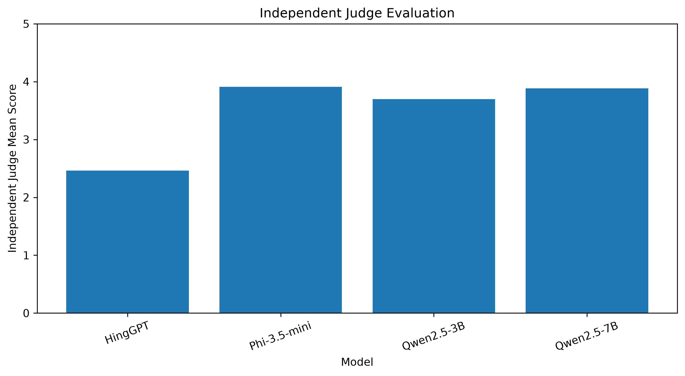
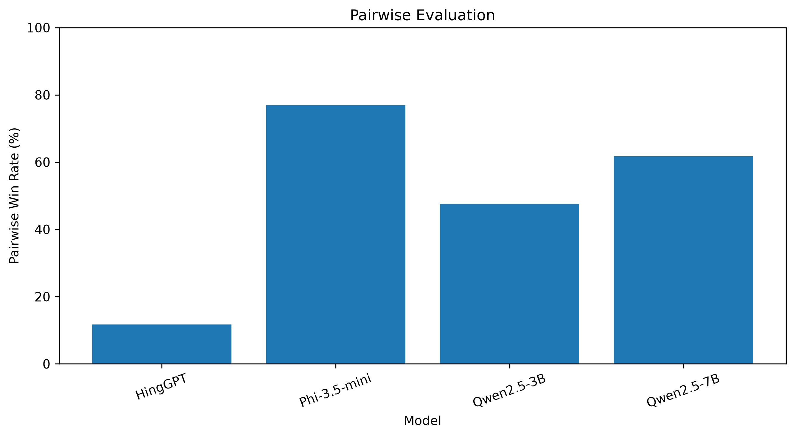
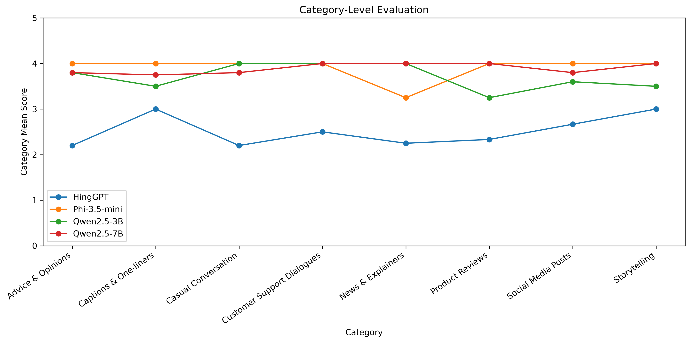
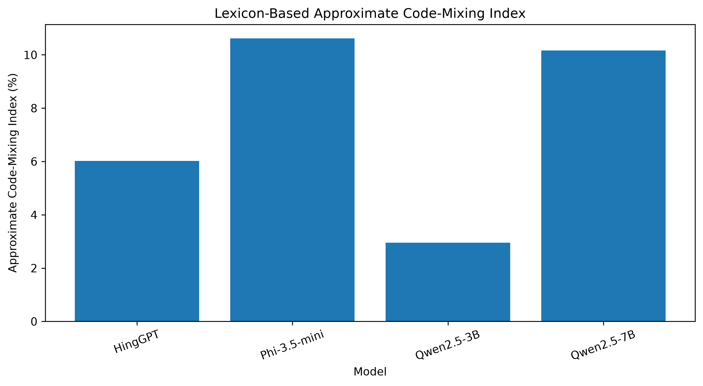

I am working on my research project:

**“A Multi-Dimensional Benchmark of LLMs for Hindi-English Code-Mixed Generation”**

Project path:
`C:\Users\vyshu\OneDrive\Desktop\HinglishLLM`

I want to COMPLETELY FINISH the research project and paper.

Do NOT modify, delete, overwrite, or regenerate anything blindly. First inspect the existing files/results, verify them, and then tell me exactly what is complete, what is missing, and what needs to be generated.

## MODELS

Evaluate these four models:

1. HingGPT
2. Phi-3.5-mini
3. Qwen2.5-3B
4. Qwen2.5-7B

## DATA / BENCHMARK

Current known information:

* Usable corpus: 14,601
* Hinglish-Bench: 1,000 prompts
* Same 1,000 prompts given to all four models
* Total controlled generations: 4,000
* 1,000 generations per model

The controlled generation file is:

`outputs\controlled_1000\benchmark_generations_.csv`

Do NOT assume any other filename without checking.

## JUDGES

Judge 1:
`mistralai/Mistral-7B-Instruct-v0.3`

Judge 2:
`allenai/OLMo-2-0425-1B-Instruct`

Expected dimensions:

* Fluency
* Code-mixing naturalness
* Hindi grammar
* Prompt adherence
* Spelling consistency
* Overall

Known judge coverage:

* Mistral: 3,990 valid, 10 missing
* OLMo-2-1B: 3,999 valid, 1 missing
* No imputation

Final judge files must be verified from the actual project files.

## IMPORTANT: NO HUMAN AUDIT

There is NO secondary human audit of 48 responses in this project.

Do not add a human-audit section.
Do not claim human validation.
Do not invent human evaluation.

## MAIN EVALUATION

First verify the actual final judge CSVs.

Calculate/verify:

* model-wise means for all six dimensions
* model-wise standard deviations if available/appropriate
* valid N
* missing N
* complete-case N

Create the main evaluation table:

Model ×

* Fluency
* Code-mixing
* Hindi grammar
* Prompt adherence
* Spelling
* Overall

Known Overall means are:

* HingGPT = 1.735
* Phi-3.5-mini = 2.206
* Qwen2.5-3B = 2.647
* Qwen2.5-7B = 2.765

Do not call Qwen2.5-7B a statistically significant winner.
Describe it only as having the highest observed mean Overall score unless statistical testing supports something stronger.

## INTER-JUDGE RELIABILITY

Verify/reproduce:

| Dimension | QWK | Spearman |
| Fluency | 0.090 | 0.204 |
| Code-mixing | 0.003 | 0.020 |
| Hindi grammar | -0.077 | -0.292 |
| Prompt adherence | -0.017 | -0.060 |
| Spelling | -0.183 | -0.322 |
| Overall | -0.024 | -0.067 |

Use actual project outputs as the source of truth.

Do not hide or artificially improve low agreement.

## JUDGE DISAGREEMENT CALIBRATION

From the actual 4,000 controlled generations:

* select 15–20 clear-cut responses
* include obvious good responses
* obvious bad responses
* obvious prompt-adherence failures
* obvious grammar/spelling cases
* obvious natural/unnatural code-switching cases

Compare Mistral and OLMo judgments on exactly those examples.

Create a calibration table:

Prompt ID | Model | Prompt | Response | Mistral scores | OLMo scores | Difference | Interpretation

Do not invent examples.
Use actual generated responses.

Then summarize the likely causes of disagreement based on the observed examples.

## ROBUSTNESS ANALYSIS

Verify the perturbed-rubric Mistral evaluation.

The perturbed rubric must:

* judge only the response
* not infer model identity
* not compare models
* evaluate dimensions independently
* distinguish natural code-switching from unnecessary switching
* judge Hindi grammar only where Hindi is present
* evaluate actual spelling
* not reward/penalize length

Calculate/verify:

* Spearman original vs perturbed
* weighted Cohen’s kappa
* mean absolute score change
* signed mean change
* model-level changes
* rank/order stability
* bootstrap 95% CIs

Create the robustness table and graph.

## STATISTICAL ANALYSIS

Verify actual statistical outputs.

For every dimension perform:

### Friedman test

Report:

* statistic
* df
* p-value

### Pairwise comparisons

All six model pairs:

1. HingGPT vs Phi-3.5-mini
2. HingGPT vs Qwen2.5-3B
3. HingGPT vs Qwen2.5-7B
4. Phi-3.5-mini vs Qwen2.5-3B
5. Phi-3.5-mini vs Qwen2.5-7B
6. Qwen2.5-3B vs Qwen2.5-7B

For each report:

* Wilcoxon statistic
* raw p-value
* Holm-adjusted p-value
* rank-biserial effect size
* bootstrap 95% CI if available

Known complete-prompt N for combined analysis:

989 per dimension.

Do not invent statistical values.

Also distinguish:

* Mistral-only analysis
* OLMo-only analysis
* exploratory combined analysis

because inter-judge agreement is low.

## ERROR ANALYSIS

Verify the existing E1–E10 results.

Known categories:

E1 English-dominant
E2 Hindi-dominant
E3 Unnatural code-switching
E4 Grammatical error
E5 Repetition
E6 Prompt misunderstanding
E7 Incomplete response
E8 Spelling/transliteration error
E9 Hallucination/factual error
E10 Irrelevant response

Known counts:

* E1 = 61 (1.525%)
* E2 = 648 (16.200%)
* E3 = 26 (0.650%)
* E4 = 284 (7.100%)
* E5 = 242 (6.050%)
* E6 = 1045 (26.125%)
* E7 = 679 (16.975%)
* E8 = 865 (21.625%)
* E9 = 0 (0.000%)
* E10 = 485 (12.125%)

Verify these from actual files.

IMPORTANT:
E9 = 0 must be described as:
“the automated detector flagged no hallucination/factual-error cases.”

Do NOT claim that the models produced zero hallucinations.

## HINGLISH-SPECIFIC METRICS

Verify:

* Hindi usage
* English usage
* Hindi-English switching
* switching behavior
* transliteration/spelling consistency
* code-mixing index

Inspect:

`outputs\hinglish_metrics\`

and all related scripts.

Create a model-level linguistic metrics table.

## REQUIRED TABLES

The final project/paper should contain:

Table 1 — Dataset and benchmark statistics

Table 2 — Model-wise evaluation results

Table 3 — Inter-judge reliability

Table 4 — Robustness analysis

Table 5 — Friedman test results

Table 6 — Pairwise Wilcoxon + Holm + effect sizes

Table 7 — E1–E10 error analysis

Table 8 — Hinglish-specific linguistic metrics

Table 9 — Missing-data summary

Verify whether each already exists.
If it exists, validate it.
If missing, generate it only from verified source data.

## REQUIRED FIGURES

Final figure set:

Figure 1 — Overall methodology pipeline

Figure 2 — Model × dimension evaluation heatmap

Figure 3 — Inter-judge agreement

Figure 4 — Robustness analysis

Figure 5 — Pairwise effect sizes

Figure 6 — E1–E10 error distribution

Figure 7 — Hinglish linguistic characteristics

Do NOT generate fake, estimated, illustrative, or guessed data.

If a graph's source data is missing, tell me exactly which source is missing.

## TRAIN / VALIDATION ISSUE

There is a number “277,431” associated with the project.

DO NOT assume that it means 277,431 training samples.

Inspect the actual project scripts, configs, logs, dataset files, trainer states, and model-output naming to determine exactly what 277,431 represents.

The current `data\processed` directory appears to contain:

`data\processed\cpt\validation.jsonl`

Do not invent a split script if none exists.

Report the exact evidence for the origin of 277,431.

## CHATBOT

Current chatbot uses:

`Qwen/Qwen2.5-7B-Instruct`

But the intended final chatbot should use:

Base:
`Qwen/Qwen2.5-3B-Instruct`

with the QLoRA adapter:

`qwen25_3b_cpt/checkpoint-17340`

using:

* AutoTokenizer
* AutoModelForCausalLM
* PeftModel

Before modifying `chatbot\app.py`:

1. Show the current file.
2. Show the exact diff.
3. Wait for my approval.
4. Only then modify it.

Never silently modify it.

## PAPER CONTENT

After the evaluation is verified, prepare:

### Results

Include:

* model comparison
* dimension-level results
* overall scores
* judge agreement
* robustness
* statistical significance
* effect sizes
* error analysis
* Hinglish linguistic characteristics

### Discussion

Discuss:

* observed differences between models
* judge disagreement
* likely reasons for disagreement based on the 15–20 calibration examples
* code-mixing behavior
* prompt-following problems
* spelling/transliteration issues
* implications of error patterns

Do not overclaim.

### Limitations

Must explicitly discuss:

1. Low inter-judge reliability
2. Differences between Mistral-7B and OLMo-2-1B
3. Smaller OLMo-2-1B judge
4. No statistically significant overall winner after Holm correction
5. Qwen2.5-7B having the highest observed mean Overall score only
6. Automated E9 detector limitations
7. Missing judge outputs and complete-case handling
8. Any other limitations actually supported by the project

Do NOT include the nonexistent 48-response human audit.

### Conclusion

Give a concise evidence-based conclusion without claiming an unsupported winner.

## CLEANUP

Do not delete anything automatically.

For every cleanup candidate:

* show path
* explain why it is redundant/temporary
* ask for confirmation before deletion

Keep important final outputs.

## FINAL OUTPUT

At the end give me a clear checklist:

### COMPLETE

* dataset
* benchmark
* generation
* Mistral evaluation
* OLMo evaluation
* reliability
* robustness
* statistics
* error analysis
* linguistic metrics
* tables
* figures
* chatbot
* paper sections

### MISSING

List only genuinely missing items.

### NEEDS VERIFICATION

List items whose files exist but whose correctness still needs checking.

### FINAL PAPER PACKAGE

Give the exact final tables, figures, scripts, outputs, and paper sections that should remain in the project.

IMPORTANT:
Work from the actual project files.
Do not fabricate values.
Do not silently correct inconsistencies.
Do not delete files.
Do not generate graphs until their underlying data has been verified.
Do not claim statistical significance unless the actual statistical test supports it.
# **A Multi-Dimensional Benchmark of LLMs for Hindi-English Code-Mixed Generation**

[](https://opensource.org/licenses/MIT)
[](https://www.python.org/downloads/)
[]()

A rigorous, reproducible evaluation framework for comparing Large Language Models (LLMs) on Hindi-English code-mixed (Hinglish) text generation across multiple task categories, linguistic dimensions, and error topologies.

## **1. Research Objective & Motivation**

Hindi-English code-mixed text is prevalent in informal communication, social media, customer interactions, and digital media. However, conventional generation metrics do not fully capture the nuances of mixed-language syntax, code-switching naturalness, prompt adherence, and transliteration quality.

This research project introduces a multi-dimensional benchmarking suite to evaluate LLMs on Hinglish generation across:

* **Fluency & Naturalness:** Adherence to natural human code-switching patterns.
* **Grammatical Integrity:** Preserving structural correctness in Hindi-English code-mixed output.
* **Prompt Adherence:** Maintaining instruction compliance under code-switched constraints.
* **Error Topologies & Linguistic Trade-offs:** Systematic analysis of language dominance, unnatural switching, repetition, grammar issues, prompt misunderstanding, incomplete responses, spelling/transliteration errors, hallucination, and irrelevant responses.

## **2. Models Evaluated**

| Model Name       | Model Type      | Core Architecture & Focus                      |
| ---------------- | --------------- | ---------------------------------------------- |
| **HingGPT**      | Specialized     | Hinglish-focused domain-adapted language model |
| **Phi-3.5-mini** | General-Purpose | Compact instruction-tuned LLM                  |
| **Qwen2.5-3B**   | General-Purpose | Efficient multilingual LLM                     |
| **Qwen2.5-7B**   | General-Purpose | Higher-capacity multilingual LLM               |

## **3. Benchmark Design & Task Taxonomy**

The controlled benchmark comprises **34 standardized prompts** spanning **8 distinct task categories** to measure model behavior across different Hinglish use cases:

| Category                       | Prompt Count | Description / Use-Case                           |
| ------------------------------ | -----------: | ------------------------------------------------ |
| **Advice & Opinions**          |            5 | Providing subjective recommendations in Hinglish |
| **Captions & One-liners**      |            4 | Social-media short-form content generation       |
| **Casual Conversation**        |            5 | Dialogues mimicking peer-to-peer chat            |
| **Customer Support Dialogues** |            3 | Service interaction and query resolution         |
| **News & Explainers**          |            4 | Informational explanation and summarization      |
| **Product Reviews**            |            4 | Consumer sentiment and product-focused responses |
| **Social Media Posts**         |            5 | Expressive and platform-oriented text generation |
| **Storytelling**               |            4 | Narrative generation blending Hindi and English  |
| **Total**                      |       **34** | Controlled Evaluation Suite                      |

## **4. Comprehensive Evaluation Pipeline**

```text
Benchmark Prompts (34 items)
       │
       ▼
Controlled Generation
(136 total responses across 4 models)
       │
       ├──────────────► Independent LLM Judge
       │                (Mistral-7B-Instruct-v0.3)
       │                     └─ 6 core dimensions (1–5 scale)
       │
       ├──────────────► Pairwise Relative Evaluation
       │                (408 directional comparisons)
       │
       ├──────────────► Human Validation
       │                (48 annotated responses)
       │
       ├──────────────► Error Taxonomy Analysis
       │                (10 error classes: E1–E10)
       │
       └──────────────► Hinglish-Specific Metrics
                        (script distribution & lexical CMI)
                              │
                              ▼
                     Statistical Validation
                              │
                              ▼
                    Research Tables & Figures
```

## **5. Experimental Results & Discussion**

### **5.1 Independent Judge Scores**

| Model Name       | Mean Overall Score | Valid Responses / Total |
| ---------------- | -----------------: | ----------------------: |
| **HingGPT**      |               2.46 |                 28 / 34 |
| **Phi-3.5-mini** |               3.91 |                 34 / 34 |
| **Qwen2.5-3B**   |               3.69 |                 33 / 34 |
| **Qwen2.5-7B**   |               3.88 |                 34 / 34 |

The independent-judge results show a substantial difference between the specialized **HingGPT** model and the three general-purpose models in this benchmark. HingGPT records a mean overall score of **2.46**, while Phi-3.5-mini, Qwen2.5-3B, and Qwen2.5-7B record **3.91, 3.69, and 3.88**, respectively.

The observed gap should not be interpreted as evidence that specialization is inherently ineffective. A more cautious interpretation is that, **under this benchmark and evaluation setup**, the general-purpose models produced responses that were more consistently aligned with the evaluated quality dimensions.

Possible contributing factors include differences in multilingual pre-training coverage, instruction tuning, model capacity, and adaptation strategy. However, the present benchmark does not experimentally isolate the causal effect of any one factor, so these should be treated as possible explanations rather than established causes.

The results should therefore be interpreted jointly with the pairwise comparisons, category-level analysis, human validation, error analysis, and missing-data sensitivity analysis rather than as a single-score ranking.

### **5.2 Pairwise Win-Rate Results**

| Model Name       | Wins | Losses | Ties | Win Rate (%) |
| ---------------- | ---: | -----: | ---: | -----------: |
| **HingGPT**      |   24 |    176 |    4 |       11.76% |
| **Phi-3.5-mini** |  157 |     47 |    0 |       76.96% |
| **Qwen2.5-3B**   |   97 |    105 |    2 |       47.55% |
| **Qwen2.5-7B**   |  126 |     76 |    2 |       61.76% |

The pairwise evaluation provides a relative view of the same benchmark behavior. HingGPT records **24 wins against 176 losses**, whereas Phi-3.5-mini records **157 wins against 47 losses**.

Qwen2.5-3B shows a more balanced comparison profile, while Qwen2.5-7B records more pairwise wins than losses. These comparisons complement the absolute judge scores by showing whether the observed differences are also reflected when model responses are compared directly.

### **5.3 Human Validation**

A human-validation subset of **48 responses** was manually annotated, with **12 responses per model**. The human annotations cover the same core quality dimensions used in the automated evaluation.

Human scores were compared with the independent Mistral judge using mean differences, Spearman correlation, and weighted quadratic Cohen's kappa.

The validation analysis shows that the human annotator was generally **stricter than the independent LLM judge** on the validation subset. This demonstrates that automated and human evaluation should not be treated as interchangeable.

Because the human-validation study contains **one annotator**, inter-annotator agreement cannot be estimated from this subset. The human-validation experiment is therefore used as a **human-in-the-loop validation and disagreement analysis**, rather than as a multi-annotator gold-standard evaluation.

## **6. Visual Results**

### **6.1 Independent Judge Scores**



### **6.2 Pairwise Win Rates**



### **6.3 Category-Level Performance**



### **6.4 Code-Mixing Index**



These visualizations provide an immediate overview of the main comparative patterns without requiring the reader to open individual CSV files.

## **7. Statistical Analysis**

Statistical analysis is used to complement the descriptive and pairwise results.

* **Friedman tests** are used for repeated multi-model comparisons where the benchmark design supports matched analysis.
* **Wilcoxon signed-rank tests** are used for pairwise matched comparisons.
* **Holm correction** is applied to control the family-wise error rate across multiple pairwise hypotheses.
* Effect sizes and sample sizes are retained alongside significance results.

The statistical outputs are available in:

```text
outputs/statistical_analysis/
├── friedman_results.csv
└── wilcoxon_holm_results.csv
```

Statistical significance is interpreted together with effect size, sample size, missing observations, and the practical magnitude of score differences.

## **8. Error Analysis**

The repository includes a structured error taxonomy covering ten categories:

| Code    | Error Type                     |
| ------- | ------------------------------ |
| **E1**  | English-dominant output        |
| **E2**  | Hindi-dominant output          |
| **E3**  | Unnatural code-switching       |
| **E4**  | Grammatical error              |
| **E5**  | Repetition                     |
| **E6**  | Prompt misunderstanding        |
| **E7**  | Incomplete response            |
| **E8**  | Spelling/transliteration error |
| **E9**  | Hallucination/factual error    |
| **E10** | Irrelevant response            |

This analysis is intended to explain **how** responses fail, complementing the overall quality scores that indicate **how much** models differ.

## **9. Hinglish-Specific Analysis**

The benchmark includes additional linguistic analysis covering:

* **Script distribution:** Latin-script and Devanagari usage.
* **Mixed-script behavior:** Degree to which responses combine script forms.
* **Roman-dominant behavior:** Frequency of Romanized output.
* **Lexical Code-Mixing Index (CMI):** A transparent heuristic for estimating English/Hindi lexical mixing.

The CMI is treated as a **heuristic structural indicator**, not as a gold-standard language-identification system.

## **10. Repository Structure**

```text
HinglishLLM/
│
├── README.md
├── requirements.txt
├── .gitignore
│
├── data/
│   └── benchmarks/
│       └── hinglish_bench_test.csv
│
├── src/
│   └── evaluation/
│
├── outputs/
│   ├── category_robustness/
│   ├── controlled_generation/
│   ├── error_analysis/
│   ├── final_charts/
│   ├── final_research_tables/
│   ├── final_robustness/
│   ├── hinglish_metrics/
│   ├── human_validation/
│   ├── independent_judge/
│   ├── pairwise_evaluation/
│   └── statistical_analysis/
│
├── FINAL_PROJECT_OUTPUTS/
│
├── run_controlled_generation.py
├── run_pairwise_evaluation.py
├── evaluate_hinggpt.py
├── evaluate_phi35_mini.py
├── evaluate_qwen25_3b.py
├── evaluate_qwen25_7b.py
├── analyze_category_robustness.py
├── analyze_error_patterns.py
├── analyze_human_agreement.py
├── analyze_pairwise.py
└── analyze_statistics.py
```

## **11. Installation & Reproduction**

### **Step 11.1: Environment Setup**

```bash
git clone https://github.com/kancharla-vyshnavi/A-Multi-Dimensional-Benchmark-of-LLMs-for-Hindi-English-Code-Mixed-Generation.git
cd A-Multi-Dimensional-Benchmark-of-LLMs-for-Hindi-English-Code-Mixed-Generation

python -m venv .venv
```

Activate the virtual environment:

```powershell
# Windows PowerShell
.\.venv\Scripts\Activate.ps1
```

```bash
# macOS / Linux
source .venv/bin/activate
```

Install dependencies:

```bash
pip install -r requirements.txt
```

### **Step 11.2: Inspecting Existing Research Outputs**

The repository preserves the generated responses and evaluation artifacts, allowing the reported analyses to be inspected without regenerating the benchmark.

```bash
python analyze_category_robustness.py
python analyze_error_patterns.py
python analyze_human_agreement.py
python analyze_pairwise.py
python analyze_statistics.py
```

Final research artifacts are available under:

```text
outputs/final_research_tables/
outputs/final_charts/
outputs/final_robustness/
FINAL_PROJECT_OUTPUTS/
```

### **Step 11.3: Re-running Model Generation**

Model-specific generation and evaluation entry points are available in the repository:

```bash
python run_controlled_generation.py

python evaluate_hinggpt.py
python evaluate_phi35_mini.py
python evaluate_qwen25_3b.py
python evaluate_qwen25_7b.py
```

Generation requires the corresponding model checkpoints and a compatible Python/PyTorch environment.

### **Step 11.4: Re-running Pairwise Evaluation**

```bash
python run_pairwise_evaluation.py
```

Pairwise outputs are stored in:

```text
outputs/pairwise_evaluation/
```

## **12. Final Research Artifacts**

### **12.1 Structured Research Outputs**

```text
outputs/
├── final_charts/
├── final_research_tables/
├── final_robustness/
├── statistical_analysis/
├── human_validation/
├── error_analysis/
└── pairwise_evaluation/
```

### **12.2 Consolidated Project Outputs**

```text
FINAL_PROJECT_OUTPUTS/
```

This directory contains consolidated tables, statistical results, error-analysis summaries, figures, and final research artifacts.

## **13. Limitations & Ethical Considerations**

* **Benchmark Size:** The benchmark contains 34 prompts and cannot represent the full diversity of Hindi-English code-mixed communication.
* **Judge Dependence:** Automated evaluation is partly dependent on the behavior of the selected Mistral judge.
* **Human Validation Size:** The human-validation subset contains 48 responses and one annotator, limiting the strength of agreement-based conclusions.
* **Missing Judgments:** Some model responses do not have valid independent-judge scores; missing-data sensitivity is therefore reported separately.
* **CMI Limitation:** The lexical CMI measure is a transparent heuristic rather than exhaustive language identification.
* **Interpretation of Causality:** Differences between models should not be treated as causal evidence for pre-training scale, architecture, or specialization because the benchmark does not experimentally isolate those factors.

## **14. Citation & License**

Licensed under the **MIT License**.

If you build upon or reference this benchmark in academic research, please cite this repository and the associated research work.
